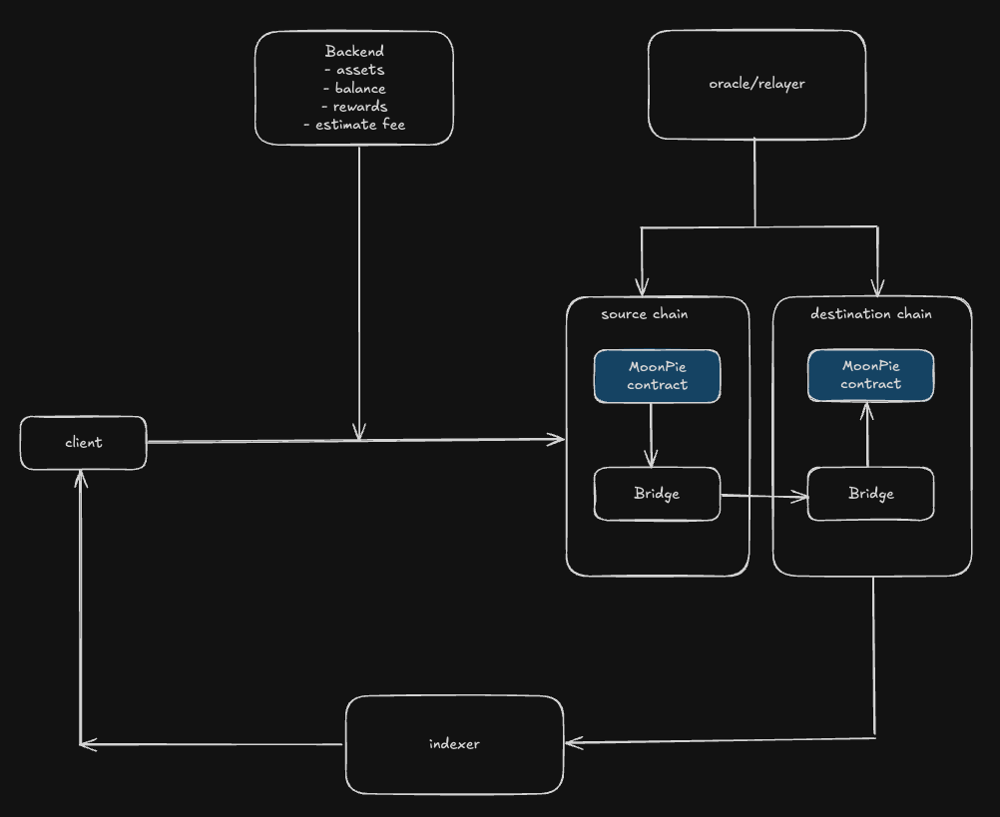

# MoonPie Bridge Contract

## Overview
MoonPieV2 is an upgradable, secure Solidity smart contract designed to facilitate cross-chain token bridging in a trustless and efficient manner. It interacts with a core bridging contract (IBridgeAssist) to handle the actual token transfer across chains




## Key Features  
**Cross-Chain Bridging:** Enables token transfers between supported networks, including Ethereum, Arbitrum, BSC, Base, Bitlayer, and a custom Asset Chain. The contract interfaces with a core bridging contract (IBridgeAssist) that executes the actual cross-chain transfer.

**Relayer System:** <br>
- MoonPie Relayer: A designated relayer address, set by the contract owner, is responsible for completing bridge transactions on the destination chain by calling completeBridge. This ensures secure finalization of transfers.<br>
- Core Bridge Relayer: The core bridging contract relies on its own relayers to validate and sign transactions, providing cryptographic signatures that MoonPieV2 verifies during transaction fulfillment.

**Token Support:** 
- Handles both ERC20 tokens and native tokens (e.g., ETH on Ethereum).
- Allows the owner to register tokens with custom fee caps to enforce minimum transaction amounts and control fee structures.

## How It Works  
**Bridge Initiation (Source Chain):** 
- Users call the bridge function, specifying the token, amount, recipient address, and core bridge contract (tokenBridge).

- MoonPieV2 calculates and deducts the applicable fee, transferring it to the treasury address.

- The remaining amount is sent to the core bridging contract (IBridgeAssist) for cross-chain transfer, either as native tokens (with msg.value) or ERC20 tokens (after approval).

- A unique requestId is generated, and the transaction details are stored in bridgeTransactions for tracking.

- The BridgeInitiated event is emitted.

**Bridge Completion (Destination Chain):** 
- The MoonPie relayer calls completeBridge, providing the source chain transaction ID, transaction details (FulfillTx), and signatures from the core bridge relayers.

- MoonPieV2 verifies the signatures and destination chain details, then instructs the core bridge contract (destinationTokenBridge) to fulfill the transfer to the recipient.

- The transaction is recorded, and the BridgeCompleted event is emitted.

## Foundry

https://book.getfoundry.sh/

## Tests
```shell
forge test --match-path test/unit/v2/MoonPieV2Source.t.sol -vv --fork-url https://mainnet-rpc.assetchain.org
```
```shell
forge test --match-path test/unit/v2/MoonPieV2Dest.t.sol -vv --fork-url https://mainnet-rpc.assetchain.org
```
```shell
forge test --match-path test/unit/v2/MoonPieV2Source.t.sol -vv --fork-url https://mainnet-rpc.assetchain.org && forge test --match-path test/unit/v2/MoonPieV2Dest.t.sol -vv --fork-url https://mainnet-rpc.assetchain.org
```

## Deployment
```shell
forge script script/MoonPie.t.s.sol --force --broadcast --rpc-url https://enugu-rpc.assetchain.org
```
```shell
forge script script/MoonPie.t.s.sol --force --broadcast --rpc-url https://arbitrum-sepolia.gateway.tenderly.co
```
```shell
forge script script/MoonPie.t.s.sol --force --broadcast --rpc-url https://sepolia.base.org
```
```shell
forge script script/MoonPie.t.s.sol --force --broadcast --rpc-url https://ethereum-sepolia-rpc.publicnode.com
```
```shell
forge script script/MoonPie.t.s.sol --force --broadcast --rpc-url https://testnet-rpc.bitlayer.org --legacy
```
```shell
forge script script/MoonPie.t.s.sol --force --broadcast --rpc-url https://bsc-testnet-rpc.publicnode.com
```
## Verify
```shell
forge verify-contract 0x9ed45ce94395d3a8c6e96ACDbF2d17fc8DBDd140 src/v2/MoonPieV2.sol:MoonPieV2 --rpc-url https://enugu-rpc.assetchain.org --verifier blockscout --verifier-url https://scan-testnet.assetchain.org/api --chain-id 42421
```
```shell
forge verify-contract 0x55bd049f934b20805609fE484Aa500ef51B0ee8A TransparentUpgradeableProxy --rpc-url https://enugu-rpc.assetchain.org --verifier blockscout --verifier-url https://scan-testnet.assetchain.org/api --chain-id 42421
```
```shell
forge verify-contract 0x231e9744b6FfD9Ecda91eA0Efc4d999003ffCAc0 src/v2/MoonPieV2.sol:MoonPieV2 --rpc-url https://testnet-rpc.bitlayer.org --verifier blockscout --verifier-url https://api-testnet.bitlayer.org/scan/api --chain-id 200810
```

## Deployments
| Network | Implementation Contract | ProxyAdmin Contract | Proxy Contract |
| --- | --- | --- | --- |
| Asset Chain Testnet | 0x9ed45ce94395d3a8c6e96ACDbF2d17fc8DBDd140 | 0x68982592dB2533d5F8e9Af7ef42Bb923858BeEDf | 0x55bd049f934b20805609fE484Aa500ef51B0ee8A |
| Arbitrum Sepolia | 0x4f625f42BfA4796F0CA2A204dccd76364E2C433B | 0x93F5A066d2F256051Aad563D1DC6b11Ed26f0304 | 0x381AFE71090cf71B75a886EA8833dfc9683c57b6 |
| Base Sepolia | 0x1b577D56F0EffCd7808e9e7579CAaB27D7ae951B | 0x338B432fD6E26f518F70450452bC81ab5911ddD9 | 0xC442e76df720456535dfE53BDc6100C48a4A9CBf |
| Bitlayer Testnet | 0x231e9744b6FfD9Ecda91eA0Efc4d999003ffCAc0 | 0xd31bf7b1A41C63e0ecE8c50D7DA8E109352b888B | 0xDe0c2ECF19BeDDE01ea0e139224b1319460BC7d1 |
